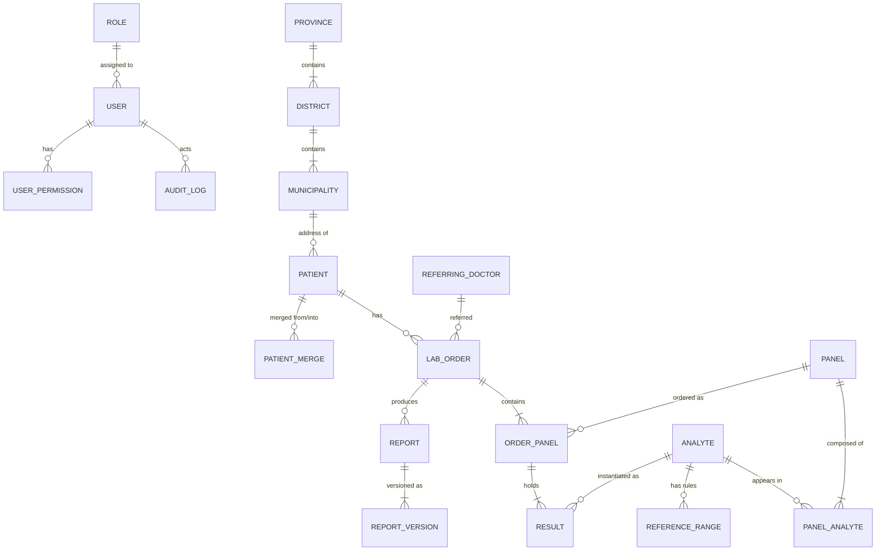

# 04 — Data Model

## 1. The one rule that governs this design

> **A released report must print identically in ten years' time, even after the
> test catalogue, the reference ranges, the letterhead and the verifying doctor
> have all changed.**

This is the same principle you already know from invoicing: an invoice line keeps
the price it was raised at, regardless of what the price list says today. Here it
applies to reference ranges, units, analyte names and the signature block.

The consequence throughout this model is **snapshotting**: at the moment a result
is entered, we copy the analyte name, unit, reference-range text and flag rules
onto the result row itself. The live catalogue is used to *populate* a result, not
to *render* it afterwards.

Without this, an admin correcting a reference range in 2027 would silently change
what a report issued in 2025 appears to say. That is a serious clinical and legal
problem and it is very easy to get wrong.

---

## 2. Entity relationship diagram

---

## 3. The catalogue (what tests exist)

These tables are edited by an admin and change rarely.

### `panel`
A printable test group as it appears on a report: *HAEMOGRAM ON CELL COUNTER*,
*LIVER FUNCTION TEST*, *URINE ANALYSIS REPORT*.

| Column | Notes |
|---|---|
| `code` | `CBC`, `LFT`, `RFT`, `LIPID`, `FBS_PPBS`, `URINE_RE`, `STOOL_RE` |
| `title` | Printed heading, e.g. `LIPID Panel` |
| `department` | `HAEMATOLOGY` / `BIOCHEMISTRY` / `CLINICAL PATHOLOGY` — the band across the report |
| `instrument_note` | e.g. `AGD2260 Fully Automated Biochemistry Analyser` |
| `footer_note` | The `Note :` paragraph, e.g. the ICSH note on the CBC |
| `display_order`, `is_active` | |

### `analyte`
One measurable line: Haemoglobin, SGPT, Urine Colour.

| Column | Notes |
|---|---|
| `code`, `name` | `name` is what prints |
| `method` | The small line under the name: `IFCC`, `Biuret`, `BCG`, `Urease GLDH` |
| `unit` | `gm/dl`, `mg/dL`, `/cmm`, `fL`, `%` |
| `value_type` | `numeric` / `text` / `picklist` |
| `picklist_options` | For urine colour, consistency, etc. |
| `decimal_places` | So 4.5 prints as `4.50` where the sample shows two decimals |
| `is_calculated`, `formula` | See section 5 |
| `critical_low`, `critical_high` | Panic values, separate from the reference range |

> **Unit normalisation needed.** The samples are internally inconsistent — the LFT
> uses both `mg/dl` and `mg/dL` on the same page. We normalise on seeding and the
> admin confirms. Cosmetic, but it is the kind of thing that makes a report look
> unprofessional.

### `panel_analyte`
Joins the two, and carries the layout.

| Column | Notes |
|---|---|
| `display_order` | |
| `group_heading` | `Differential Leucocyte Count (DLC)`, `Absolute Leucocyte Count`, `Physical Examination`, `Chemical Examination`, `Microscopic Examination` — a bold sub-row with no value |
| `is_optional` | Analytes a technician may leave blank without the report looking incomplete |

### `reference_range`
Deliberately **not** a `min`/`max` pair. See `05-report-engine.md` section 3 for why.

| Column | Notes |
|---|---|
| `analyte_id` | |
| `applies_sex` | `M` / `F` / `any` |
| `applies_age_min`, `applies_age_max` | Years; null means unbounded |
| `range_type` | `interval` / `upper_limit` / `lower_limit` / `bands` / `text_only` |
| `low`, `high` | Numeric bounds where applicable |
| `display_text` | Exactly what prints, e.g. `Male : 12-18`, `Upto 45`, or the three-line triglyceride block |
| `bands` (JSON) | For interpretive ranges: `[{label:"Normal", high:160}, {label:"Border-line High", low:161, high:199}, {label:"High", low:200}]` |
| `effective_from`, `effective_to` | Ranges are versioned, never overwritten |
| `source_note` | Where the range came from — analyser manual, textbook, lab validation |

---

## 4. The clinical record (what happened to a patient)

### `patient`

| Column | Notes |
|---|---|
| `mrn` | Human-facing ID, printed as `Reg No` |
| `full_name`, `name_devanagari` | Second field exists from day one, unused in v1 UI |
| `sex` | `M` / `F` / `Other`. Drives sex-conditional ranges. |
| `dob` **or** `age_years` + `age_recorded_on` | See below |
| `phone`, `municipality_id`, `ward`, `address_line` | |
| `search_vector` | Precomputed, indexed, powers sub-200ms fuzzy search |
| `is_deleted`, `deleted_by`, `deleted_at` | Soft delete only |

**On age:** where a patient gives "about 45", we store 45 plus the date it was
recorded, and derive age at any later sample date from that. Where a real DOB is
known, we use it. Reports always print **age at sample date**, never age today.

### `lab_order`
One visit to the lab. Printed as `Reg Date` on the report.

`accession_no`, `patient_id`, `referring_doctor_id`, `sample_collected_at`,
`status`, plus attributed timestamps for each status change.

### `order_panel`
Which panels were ordered on this visit. Snapshots `panel_title`,
`department`, `instrument_note` and `footer_note` at order time.

### `result` — the important one
One row per analyte per order. Every snapshot field exists for the reason in
section 1.

| Column | Notes |
|---|---|
| `order_panel_id`, `analyte_id` | |
| `value_numeric` | Null for text results |
| `value_text` | For `Pale yellow`, `Nil`, `2-4 /hpf` |
| `analyte_name_snapshot` | What printed |
| `method_snapshot`, `unit_snapshot` | |
| `range_display_snapshot` | The exact reference text that printed |
| `range_low_snapshot`, `range_high_snapshot` | For recomputing the flag if ever audited |
| `flag` | `N` / `H` / `L` / `critical` — computed at entry, then **stored**, not recomputed on view |
| `entered_by`, `entered_at`, `is_calculated` | |

### `report` and `report_version`

`report` is the stable thing a patient refers to. `report_version` is what actually
printed.

| `report_version` column | Notes |
|---|---|
| `version_no` | 1, 2, 3... |
| `pdf_path`, `pdf_sha256` | The hash proves the file was never altered |
| `is_amendment`, `amendment_reason`, `amends_version_id` | |
| `released_by`, `released_at` | |
| `verifier_name_snapshot`, `verifier_qualification_snapshot`, `verifier_nmc_snapshot` | The signature block as it was on that day |
| `letterhead_mode` | `full` or `preprinted` |

Version rows are **insert-only**. There is no update path in the application, and
the database enforces it with a trigger, not just a convention in the code.

---

## 5. Calculated analytes

About one in five values on the supplied reports is derived. Extracted from the
samples:

| Analyte | Formula |
|---|---|
| BUN | `Blood Urea / 2.14` |
| BUN / Creatinine ratio | `BUN / Creatinine` |
| Serum Globulin | `Total Protein - Albumin` |
| A/G ratio | `Albumin / Globulin` |
| SGOT / SGPT ratio | `SGOT / SGPT` |
| Bilirubin Indirect | `Bilirubin Total - Bilirubin Direct` |
| VLDL Cholesterol | `Triglycerides / 5` |
| Cholesterol / HDL ratio | `Cholesterol / HDL` |
| Triglycerides / HDL ratio | `Triglycerides / HDL` |
| LDL / HDL ratio | `LDL / HDL` |
| Absolute Neutrophils (and 4 others) | `TLC * (Neutrophil % / 100)` |

Stored as a formula string against the analyte, evaluated by a small restricted
expression engine — **not** by executing arbitrary code, which would be a security
hole.

Rules:
- A calculated field is read-only in the UI and recomputes live.
- If an input is missing, the output is blank, not zero. A blank potassium must
  never produce a confident-looking ratio of `0.00`.
- Division by zero yields blank, never an error message on a patient's report.
- **Every formula gets a unit test with values taken from a real report.** This is
  where silent, expensive, clinically dangerous bugs live.

> **Please confirm the BUN divisor.** `Urea / 2.14` is the standard conversion,
> but some Nepali labs report BUN directly from the analyser instead of deriving
> it. The RFT sample shows both Urea and BUN with separate ranges, which does not
> settle the question. The lab in-charge will know in five seconds.

---

## 6. Audit log

| Column | Notes |
|---|---|
| `actor_user_id`, `action`, `entity_type`, `entity_id`, `occurred_at`, `ip`, `user_agent` | |
| `detail` (JSON) | Before/after for edits — **field names and non-identifying values only** |

- Append-only, enforced by a database trigger that rejects UPDATE and DELETE.
- **Viewing a patient record is logged, not just editing it.** This is what lets
  you answer "who looked at this person's HIV result".
- Retained for the full clinical retention period, longer than the records
  themselves where the two differ.

---

## 7. What the model deliberately leaves room for

Not built in v1, but the shape is ready:

- `lab_order` generalises to `encounter` when OPD arrives — the FK is already
  patient-level, not lab-level.
- `panel` / `analyte` extend to imaging findings without a new structure.
- `invoice` and `invoice_line` attach cleanly to `lab_order` when billing arrives,
  with the same snapshot discipline.
- `patient_merge` exists in v1 because duplicates start on day one and are
  vastly harder to untangle after a year.
